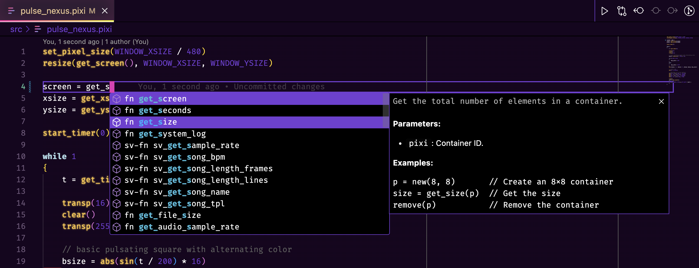

# Pixilang Syntax & IntelliSense

**Pixilang Syntax & IntelliSense** is a Visual Studio Code extension designed to enhance the Pixilang programming experience by providing syntax highlighting, IntelliSense, and detailed documentation with examples.

---

## Features

- **Syntax Highlighting**: Pixilang code is color-coded for better readability.
- **IntelliSense**: Autocompletion for Pixilang's built-in constants, functions and reserved properties.
- **Hover Documentation**: Detailed descriptions, parameter explanations, and examples for built-in functions.
- **Wide Function Coverage**: Basically all built-in features, such as:
  - Graphics
  - OpenGL
  - Animation
  - Threads
  - File Handling
  - Networking
  - System Calls
  - Sunvox-specific Constants and Functions

## Extension Settings

This extension does not add specific settings at this time. Future updates may include configurable options.

## Future Plans

- Add debugging tools for Pixilang.

## For More Information

- [Pixilang Official Website](http://warmplace.ru/soft/pixilang/)
- [Visual Studio Code Extension Development](https://code.visualstudio.com/api)

**Enjoy coding with Pixilang!**
